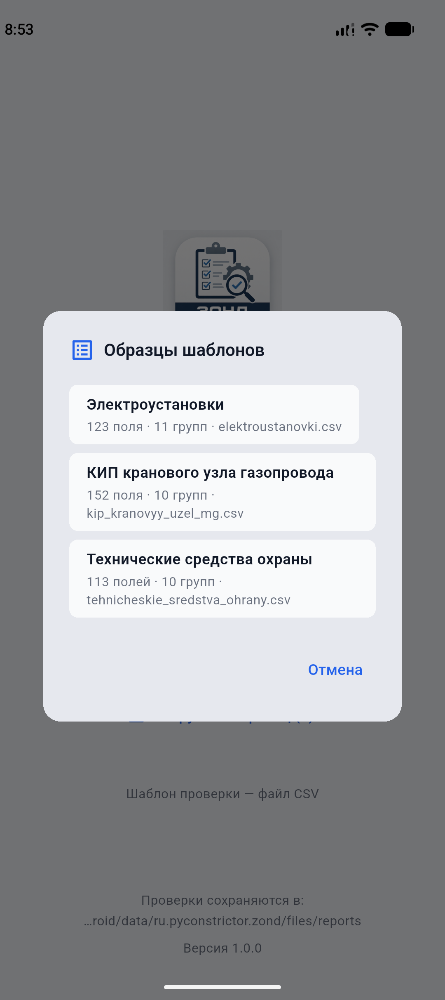

# Сборка приложения для мобильного устройства

Приложение подготовлено к работе на Android и iOS. Документ описывает, что уже
учтено в коде, что нужно установить для сборки и как установить приложение на
устройство.

> **Состояние проверки.** APK собран, установлен и запущен на эмуляторе
> Android 17 (Pixel 9, arm64-v8a). Проверено: приложение стартует, стартовый
> экран отображается, системный выбор файла открывается, список встроенных
> образцов показывает все три шаблона с числом полей и групп, выбранный
> шаблон разбирается (113 полей, 48 обязательных). Сборка iOS не проверялась:
> на машине не установлен полный Xcode. Остальные пункты чек-листа из
> раздела 7 ждут проверки на реальном устройстве.

### Как это выглядит на устройстве

Снимки сделаны на эмуляторе Pixel 9 (Android 17) с установленного APK.

| Стартовый экран | Встроенные образцы | Шаблон загружен |
|---|---|---|
|  |  |  |

Ниже стартового экрана видно строку «Проверки сохраняются в: …» — по ней
всегда можно понять, куда приложение пишет данные.

---

## 1. Что уже учтено в коде

| Особенность мобильных платформ | Как решено |
|---|---|
| Каталог рядом с приложением доступен только для чтения | Данные проверок переносятся в каталог документов приложения (`flet.StoragePaths`), см. `ZondApp.prepare()` |
| Файловый диалог не отдаёт локальный путь к выбранному файлу | Файл запрашивается вместе с содержимым (`with_data=True`) и сохраняется в рабочий каталог приложения |
| Фильтр по расширениям поддерживают не все платформы | `allowed_extensions` передаётся только там, где он работает |
| Ссылку `file://` нельзя открыть другим приложением | PDF отдаётся в системное меню «Поделиться» (`flet.Share`) |
| Интерфейс уходит под строку состояния и «бровь» | Содержимое экранов оборачивается в `flet.SafeArea` |
| Окно и его размеры на телефоне задаёт система | Настройка окна применяется только на настольных платформах |
| Выбрать CSV из памяти телефона неудобно | В приложение встроены готовые образцы шаблонов: кнопка «Загрузить образец» на стартовом экране |

Точка входа для сборки — `main.py` в корне репозитория. **Он обязан
запускать приложение сам**, на уровне модуля:

```python
from zond.ects import run

run()  # внутри ft.run(main, assets_dir=...)
```

Загрузчик собранного приложения импортирует модуль и `main(page)` **не
вызывает**. Если модуль только объявит функцию, приложение запустится и сразу
завершится — причём штатно, с кодом 0 и без сообщений об ошибке: со стороны
это выглядит как мгновенное закрытие. Именно на это ушла большая часть
отладки первой сборки, поэтому правило выделено отдельно.

Для настольного запуска по-прежнему работают `python -m zond.ects` и команда
`zond-ects`.

---

## 2. Что нужно установить

### Для Android

1. **Flutter SDK** — <https://docs.flutter.dev/get-started/install>
   Проверка: `flutter doctor -v`.
2. **Android SDK** (обычно ставится вместе с Android Studio) и переменная
   окружения `ANDROID_HOME`.
3. **JDK 17** — требование текущих версий Gradle в Android-сборке.

### Для iOS

1. macOS и **Xcode** с установленными Command Line Tools.
2. Аккаунт разработчика Apple для подписи: `--ios-team-id <ID>`.

### Проверка окружения

```bash
flutter doctor -v    # инструменты сборки
```

Что уже выяснилось при первой сборке на рабочей машине:

* **`flet` требует Flutter 3.44.x** и не принимает другие минорные версии.
  Если установлена другая (например, 3.47), `flet build` предложит скачать
  нужную версию в свой кэш — это нормально и вашу установку Flutter не трогает.
  Флаг `--yes` подтверждает установку без вопроса.
* **Java.** Системная команда `java` на macOS может быть заглушкой, которая
  просит установить Runtime. Рабочий JDK есть в Android Studio, поэтому перед
  сборкой укажите его:

  ```bash
  export JAVA_HOME="/Applications/Android Studio.app/Contents/jbr/Contents/Home"
  export PATH="$JAVA_HOME/bin:$PATH"
  export ANDROID_HOME="$HOME/Library/Android/sdk"
  ```

* Flutter из `.zprofile` не попадает в `PATH` неинтерактивных оболочек, поэтому
  при сборке из скрипта добавьте его явно:

  ```bash
  export PATH="$HOME/develop/flutter/bin:$PATH"
  ```

---

## 3. Сборка

Все команды выполняются из корня репозитория, в активированном окружении
проекта.

```bash
source .venv/bin/activate
```

Параметры приложения (название, идентификатор пакета, заставка, исключения)
заданы в `pyproject.toml` в разделе `[tool.flet]` — повторять их в командной
строке не нужно.

### Android

```bash
# APK для установки вручную
flet build apk --yes

# APK отдельно под каждую архитектуру: файлы меньше
flet build apk --split-per-abi

# AAB для публикации в Google Play
flet build aab
```

Результат: `build/apk/app-release.apk` или `build/aab/app-release.aab`.

### iOS

```bash
flet build ipa --ios-team-id <TEAM_ID>
```

Результат: `build/ipa/`.

### Быстрая проверка без установки

```bash
flet run --android      # запуск на подключённом устройстве или эмуляторе
flet devices            # список устройств
flet emulators          # список эмуляторов
```

---

## 4. Установка на устройство

### Android

```bash
adb install -r build/apk/app-release.apk
```

Либо скопируйте APK на телефон и откройте его; потребуется разрешить установку
из неизвестных источников.

### iOS

Установка напрямую возможна через Xcode (Window → Devices and Simulators) или
через систему распространения организации (TestFlight, MDM). Для внутреннего
распространения нужен профиль подписи.

---

## 5. Настройка под свою организацию

Перед публикацией обязательно замените в `pyproject.toml`:

```toml
[tool.flet]
org = "ru.gazprom"                 # обратный домен организации
bundle_id = "ru.gazprom.zond.ects" # идентификатор пакета
product = "ЗОНД: ECTS"             # название на экране устройства
company = "ПАО «Газпром»"
copyright = "© 2026 ПАО «Газпром»"
```

`org` и `bundle_id` должны быть согласованы с ИТ-службой: по ним приложение
идентифицируется в магазинах и в системах управления мобильными устройствами.
Идентификатор пакета после публикации менять нельзя.

Иконка приложения берётся из `assets/icon.png` (1024×1024). Если нужны отдельные
иконки под платформы, добавьте `assets/icon_android.png` и `assets/icon_ios.png`.

---

## 6. Где приложение хранит данные

| Платформа | Каталог |
|---|---|
| Android | внутренний каталог приложения: `/data/data/ru.pyconstrictor.zond/files/reports/` |
| iOS | каталог документов приложения: `reports/` (виден в приложении «Файлы») |
| Настольные | `reports/` в корне репозитория |

На Android это внутренняя память приложения: в файловом менеджере её не видно,
и `adb pull` без отладочной сборки тоже не поможет. Единственный рабочий
способ забрать протокол — кнопка **«Поделиться»**; поэтому она и вынесена на
экран итогов. Путь всегда показан на стартовом экране.

Внутри — та же структура: `drafts/`, `inspections/`, `pdf/`, `incoming/`
(сюда попадают файлы, выбранные на мобильной платформе).

Сформированный протокол отправляется кнопкой «Поделиться»; на iOS те же
файлы лежат в приложении «Файлы».

---

## 7. Что проверить на устройстве

Чек-лист первой сборки — то, что нельзя проверить без реального устройства:

- [ ] Приложение запускается и открывается стартовый экран.
- [ ] Кнопка «Загрузить образец» показывает список и загружает шаблон КИП.
- [ ] Экран проверки прокручивается, подписи полей переносятся по строкам.
- [ ] Обязательные поля выделены цветом, валидация не даёт перейти дальше.
- [ ] Выбор даты и времени открывает системные диалоги.
- [ ] Черновик сохраняется: выйдите из приложения и продолжите проверку.
- [ ] Файл, выбранный из памяти устройства, читается (проверяет ветку с `with_data`).
- [ ] PDF формируется и открывается через «Поделиться», файл открывается в просмотрщике.
- [ ] Интерфейс не заходит под строку состояния и не перекрывается системной навигацией.
- [ ] При повороте экрана интерфейс остаётся работоспособным.
- [ ] Длинный список из 152 полей заполняется без заметных задержек.

Пункты 6, 7 и 10 — самые вероятные места проблем, потому что они зависят от
конкретной платформы, а не от кода приложения.

---

## 8. Возможные сложности

| Симптом | Причина и решение |
|---|---|
| `flet build` не находит Flutter | Установите Flutter SDK и добавьте `flutter` в `PATH`, проверьте `flutter doctor` |
| Сборка Android падает на Gradle | Проверьте JDK 17 и `ANDROID_HOME` |
| В приложении нет кнопки «Загрузить образец» | Каталог `templates/` не попал в сборку: проверьте, что он не указан в `[tool.flet.app] exclude` |
| Выбранный файл не читается | Платформа не вернула содержимое: проверьте, что используется `with_data=True` |
| PDF не открывается | На мобильных используется меню «Поделиться»; при его недоступности путь к файлу показывается в диалоге |
| Файлы не сохраняются | Проверьте, что `prepare()` вызывается до показа интерфейса и каталог документов доступен |

---

## 9. Размер сборки

Что влияет на размер и что уже сделано:

* `[tool.flet.app] exclude` исключает из пакета виртуальное окружение, тесты,
  инструменты и документацию — без этого в сборку попала бы среда разработки;
* логотип интерфейса уменьшен с 1254×1254 (1,9 МБ) до 512×512 (265 КБ);
* иконка приложения хранится отдельно в `assets/icon.png`.

Собранный APK занимает около 150 МБ: в него входят среда Python и нативные
библиотеки сразу под три архитектуры. Для установки на конкретный телефон
используйте `flet build apk --split-per-abi` — получится три файла примерно
по 50 МБ, из которых нужен один.

Оставшийся вес определяется в основном средой Python внутри пакета.
