# Сборка приложения для мобильного устройства

Приложение подготовлено к работе на Android и iOS. Документ описывает, что уже
учтено в коде, что нужно установить для сборки и как установить приложение на
устройство.

> **Состояние проверки.** APK собран, установлен и проверен на эмуляторе
> Android 17 (Pixel 9, arm64-v8a). Пройден весь путь: запуск → выбор шаблона →
> заполнение формы → проверка обязательных полей → загрузка проверки из памяти
> устройства → формирование PDF на телефоне → отправка через «Поделиться».
> PDF, созданный на устройстве, скачан по USB и проверен: 6 страниц,
> кириллица, цветная сводка, встроенный шрифт.
>
> Сборка iOS не проверялась: на машине не установлен полный Xcode.

### Идентификатор пакета и имена папок

`ru.pyconstrictor.zond` — это **идентификатор приложения** (application id), а
не название для пользователя. Android требует обратный домен владельца, поэтому
он складывается из `org` и имени приложения в `pyproject.toml`:

```toml
[tool.flet]
org = "ru.pyconstrictor"     # домен владельца наоборот
bundle_id = "ru.pyconstrictor.zond"
product = "ЗОНД: ECTS"       # это название видит пользователь
```

Идентификатор используется системой: по нему приложение значится в магазине и в
системах управления устройствами, он же становится именем служебных каталогов
`/Android/data/<идентификатор>/`. После публикации менять его нельзя: для
Android это будет уже другое приложение.

Служебные каталоги пользователю не показываются — протоколы кладутся в общую
папку `Документы/ЗОНД`, а на стартовом экране и в справке видно именно это
название.

### Как это выглядит на устройстве

Снимки сделаны на эмуляторе Pixel 9 (Android 17) с установленного APK.

| Стартовый экран | Встроенные образцы | Шаблон загружен |
|---|---|---|
| 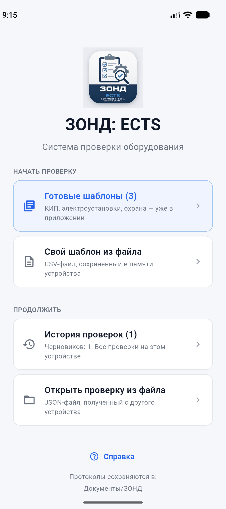 | 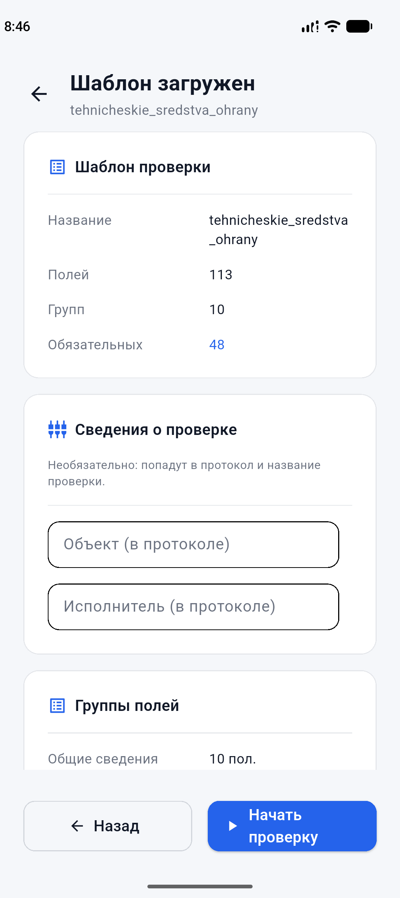 | 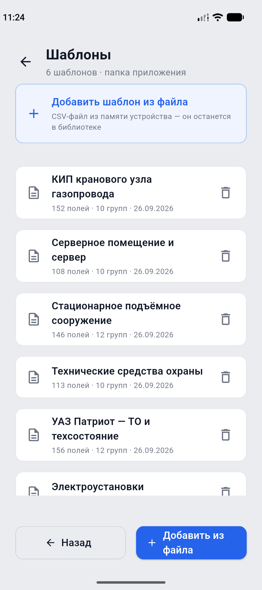 |

Ниже стартового экрана видно строку «Проверки сохраняются в: …» — по ней
всегда можно понять, куда приложение пишет данные.

---

## 1. Что уже учтено в коде

| Особенность мобильных платформ | Как решено |
|---|---|
| Каталог рядом с приложением доступен только для чтения | Данные проверок переносятся в каталог документов приложения (`flet.StoragePaths`), см. `ZondApp.prepare()` |
| Файловый диалог не отдаёт локальный путь к выбранному файлу | Файл запрашивается вместе с содержимым (`with_data=True`) и сохраняется в рабочий каталог приложения |
| Фильтр по расширениям поддерживают не все платформы | `allowed_extensions` передаётся только там, где он работает |
| Ссылку `file://` нельзя открыть другим приложением | PDF отдаётся в системное меню «Поделиться» (`flet.Share`) |
| Интерфейс уходит под строку состояния и «бровь» | Содержимое экранов оборачивается в `flet.SafeArea` |
| Окно и его размеры на телефоне задаёт система | Настройка окна применяется только на настольных платформах |
| Выбрать CSV из памяти телефона неудобно | В приложение встроены примеры шаблонов: карточка «Выбрать шаблон проверки» на стартовом экране |

Точка входа для сборки — `main.py` в корне репозитория. **Он обязан
запускать приложение сам**, на уровне модуля:

```python
from zond.ects import run

run()  # внутри ft.run(main, assets_dir=...)
```

Загрузчик собранного приложения импортирует модуль и `main(page)` **не
вызывает**. Если модуль только объявит функцию, приложение запустится и сразу
завершится — причём штатно, с кодом 0 и без сообщений об ошибке: со стороны
это выглядит как мгновенное закрытие. Именно на это ушла большая часть
отладки первой сборки, поэтому правило выделено отдельно.

Для настольного запуска по-прежнему работают `python -m zond.ects` и команда
`zond-ects`.

---

## 2. Что нужно установить

### Для Android

1. **Flutter SDK** — <https://docs.flutter.dev/get-started/install>
   Проверка: `flutter doctor -v`.
2. **Android SDK** (обычно ставится вместе с Android Studio) и переменная
   окружения `ANDROID_HOME`.
3. **JDK 17** — требование текущих версий Gradle в Android-сборке.

### Для iOS

1. macOS и **Xcode** с установленными Command Line Tools.
2. Аккаунт разработчика Apple для подписи: `--ios-team-id <ID>`.

### Проверка окружения

```bash
flutter doctor -v    # инструменты сборки
```

Что уже выяснилось при первой сборке на рабочей машине:

* **`flet` требует Flutter 3.44.x** и не принимает другие минорные версии.
  Если установлена другая (например, 3.47), `flet build` предложит скачать
  нужную версию в свой кэш — это нормально и вашу установку Flutter не трогает.
  Флаг `--yes` подтверждает установку без вопроса.
* **Java.** Системная команда `java` на macOS может быть заглушкой, которая
  просит установить Runtime. Рабочий JDK есть в Android Studio, поэтому перед
  сборкой укажите его:

  ```bash
  export JAVA_HOME="/Applications/Android Studio.app/Contents/jbr/Contents/Home"
  export PATH="$JAVA_HOME/bin:$PATH"
  export ANDROID_HOME="$HOME/Library/Android/sdk"
  ```

* Flutter из `.zprofile` не попадает в `PATH` неинтерактивных оболочек, поэтому
  при сборке из скрипта добавьте его явно:

  ```bash
  export PATH="$HOME/develop/flutter/bin:$PATH"
  ```

---

## 3. Сборка

Все команды выполняются из корня репозитория, в активированном окружении
проекта.

```bash
source .venv/bin/activate
```

Параметры приложения (название, идентификатор пакета, заставка, исключения)
заданы в `pyproject.toml` в разделе `[tool.flet]` — повторять их в командной
строке не нужно.

### Android

```bash
# APK для установки вручную
flet build apk --yes

# APK отдельно под каждую архитектуру: файлы меньше
flet build apk --split-per-abi

# AAB для публикации в Google Play
flet build aab
```

Результат: `build/apk/app-release.apk` или `build/aab/app-release.aab`.

### iOS

```bash
flet build ipa --ios-team-id <TEAM_ID>
```

Результат: `build/ipa/`.

### Быстрая проверка без установки

```bash
flet run --android      # запуск на подключённом устройстве или эмуляторе
flet devices            # список устройств
flet emulators          # список эмуляторов
```

---

## 4. Готовый установочный файл

APK собирается на GitHub Actions — вручную его собирать не нужно:

```bash
git tag v1.0.0
git push origin v1.0.0
```

По тегу запускается `.github/workflows/android.yml`: прогоняет линтер и тесты,
собирает APK и прикрепляет его к релизу. Скачать файл можно со страницы
релиза без учётной записи GitHub. Запустить сборку вручную, без тега, можно из
вкладки Actions — тогда APK лежит в артефактах запуска.

В самом репозитории APK не хранится. Файл весит около 150 МБ, а история git
неизменяема: сложенный в репозиторий APK остался бы в ней навсегда, и каждый
клон тянул бы все версии сразу. Релизы для этого и предназначены.

> Первая сборка идёт долго: `flet` скачивает свою версию Flutter, потому что
> требует строго 3.44.x и не принимает установленную на машине.

### Закрепление jni_flutter

В `pyproject.toml` есть закрепление версии пакета `jni_flutter`:

```toml
[tool.flet.flutter.pubspec.dependency_overrides]
jni_flutter = "1.0.3"
```

Это обход дефекта во внешнем пакете: `jni_flutter` 1.0.4 собран против `jni`
1.1.0, хотя объявляет `^1.0.0`. Сгенерированные привязки не проходят проверку
версии, и сборка падает на этапе Gradle:

```
The generated bindings expect package:jni ^1.1.0, but 1.0.x was imported
```

Flet фиксирует `jni` 1.0.0, поэтому закрепляется последний совместимый выпуск
`jni_flutter`. Локально ошибка не проявлялась: в кэше pub уже лежала совместимая
версия, и разрешение зависимостей давало другой результат, чем в чистом
окружении.

Закрепление можно убрать, когда Flet обновит свои зависимости.

### Ключ подписи

По умолчанию `flet build apk` подписывает сборку отладочным ключом, который
создаётся заново на каждой машине и на каждом запуске GitHub Actions. Android
не устанавливает обновление поверх приложения, подписанного другим ключом:
выдаёт `INSTALL_FAILED_UPDATE_INCOMPATIBLE` и сообщение «signatures do not
match». Без своего ключа каждую новую версию пришлось бы ставить только после
удаления прежней — вместе со всеми данными.

Ключ создаётся один раз:

```bash
bash tools/make_signing_key.sh
```

Локальная сборка тем же ключом:

```bash
bash tools/build_apk.sh
```

Такой файл совместим с выпущенным: его можно поставить поверх, и наоборот.

Скрипт положит ключ и файл с паролями в `~/zond-signing/` — вне репозитория.
**Сделайте копию ключа.** Если он потеряется, обновления перестанут
устанавливаться поверх: останется только просить пользователей удалять
приложение.

Дальше добавьте четыре секрета в GitHub: репозиторий → Settings → Secrets and
variables → Actions → New repository secret. Точные значения перечислены в
файле `~/zond-signing/данные-ключа.txt`:

| Секрет | Что это |
|---|---|
| `ANDROID_KEYSTORE_BASE64` | сам ключ в base64 |
| `ANDROID_KEYSTORE_PASSWORD` | пароль хранилища |
| `ANDROID_KEY_PASSWORD` | пароль ключа |
| `ANDROID_KEY_ALIAS` | псевдоним ключа |

Без этих секретов сборка **по тегу падает**: выпускать APK с отладочной
подписью нельзя, он не установится поверх прежней версии. Ручной запуск без
секретов разрешён — такой файл годится только для проверки.

Дополнительно проверяется сама подпись собранного файла: если он всё же
подписан отладочным ключом, сборка останавливается. Наличие секрета — ещё не
гарантия, что он задан верно.

**Переход на свой ключ требует одного удаления приложения.** Все выпущенные
до этого сборки подписаны отладочным ключом, который не совпадает с вашим:
Android откажется ставить обновление. После первого выпуска с новым ключом
обновления ставятся поверх обычным образом.

Чтобы локальная сборка была совместима с выпущенной, экспортируйте те же
значения перед `flet build apk` — команда есть в том же файле.


### Ручная публикация релиза

Если сборка на GitHub ещё не запускалась, APK можно приложить к релизу вручную.

1. Соберите файл локально: `flet build apk --yes`. Он появится в
   `build/apk/zond-ects.apk`.
2. Откройте страницу репозитория → **Releases** → **Draft a new release**.
3. В поле **Choose a tag** впишите `v1.0.0` и нажмите
   **Create new tag on publish**. Важно, чтобы в поле **Target** стояла ветка
   `main`.
4. В **Release title** впишите `ЗОНД: ECTS 1.0.0`.
5. В поле описания вставьте текст из заготовки ниже.
6. Перетащите `build/apk/zond-ects.apk` в область **Attach binaries**. Файл
   весит около 150 МБ, загрузка займёт время — дождитесь, пока он перестанет
   отображаться как загружающийся.
7. Нажмите **Publish release**.

**Заготовка описания:**

```markdown
Первый выпуск.

**Установка.** Скачайте файл `zond-ects.apk` ниже, откройте его на телефоне и
разрешите установку из неизвестных источников. Либо по USB:
`adb install -r zond-ects.apk`.

**Что внутри.** Шесть шаблонов проверок, разбор замечаний прошлой проверки со
статусами, протоколы PDF, библиотека шаблонов в `Документы/ЗОНД/Шаблоны`.

**Требования.** Android 7 и новее.

Контрольная сумма SHA-256 указана в описании файла.
```

**О теге.** Создание релиза с новым тегом запускает тот же workflow: он
пересоберёт APK и заменит приложенный вами файл на собранный из тега. Это
нормально — файл в релизе будет соответствовать исходникам тега. Если замена
не нужна, отмените запуск во вкладке **Actions** сразу после публикации.

**Проверка.** Откройте страницу релиза в режиме инкогнито — без входа в
GitHub. Ссылка на APK должна скачиваться: значит, файл доступен любому, кому
вы её передадите.


---

## Поделиться приложением

Ссылки ведут на **последний** выпуск, поэтому их можно дать один раз и больше
не обновлять. Репозиторий публичный: учётная запись GitHub не нужна.

| Что | Ссылка |
|---|---|
| Страница выпуска | `https://github.com/aleksey-s-lozhkin/zond/releases/latest` |
| Файл напрямую | `https://github.com/aleksey-s-lozhkin/zond/releases/latest/download/zond-ects.apk` |

Первую удобнее открыть на телефоне: видно описание и файл. Вторая скачивает
сразу, без лишних нажатий.


QR ведёт на страницу последнего выпуска — можно показать с экрана или
распечатать.

**Текст для письма или мессенджера:**

> ЗОНД: ECTS — приложение для проверок оборудования.
>
> Скачать: https://github.com/aleksey-s-lozhkin/zond/releases/latest
>
> Откройте ссылку на телефоне, скачайте `zond-ects.apk` и установите. Android
> попросит разрешить установку из неизвестных источников — это обычное дело,
> приложение распространяется вне магазина.
>
> Если стояла версия 1.0.3 или раньше, её нужно сначала удалить: подписи не
> совпадают. Начиная с 1.0.4 обновления ставятся поверх.

---

## 5. Установка на устройство

### Android

```bash
adb install -r build/apk/app-release.apk
```

Либо скопируйте APK на телефон и откройте его; потребуется разрешить установку
из неизвестных источников.

### iOS

Установка напрямую возможна через Xcode (Window → Devices and Simulators) или
через систему распространения организации (TestFlight, MDM). Для внутреннего
распространения нужен профиль подписи.

---

## 6. Настройка под свою организацию

Перед публикацией обязательно замените в `pyproject.toml`:

```toml
[tool.flet]
org = "ru.gazprom"                 # обратный домен организации
bundle_id = "ru.gazprom.zond.ects" # идентификатор пакета
product = "ЗОНД: ECTS"             # название на экране устройства
company = "ПАО «Газпром»"
copyright = "© 2026 ПАО «Газпром»"
```

`org` и `bundle_id` должны быть согласованы с ИТ-службой: по ним приложение
идентифицируется в магазинах и в системах управления мобильными устройствами.
Идентификатор пакета после публикации менять нельзя.

Иконка приложения берётся из `assets/icon.png` (1024×1024). Если нужны отдельные
иконки под платформы, добавьте `assets/icon_android.png` и `assets/icon_ios.png`.

---

## 7. Где приложение хранит данные

Готовые протоколы и служебные данные лежат раздельно. Протокол забирают с
телефона, поэтому он попадает туда, где пользователь ищет файлы сам:

| Что | Android | iOS | Настольные |
|---|---|---|---|
| Протоколы PDF | `Документы/ЗОНД/Протоколы` | каталог документов приложения | `~/Documents/ЗОНД/Протоколы` |
| Библиотека шаблонов | `Документы/ЗОНД/Шаблоны` | там же | `~/Documents/ЗОНД/Шаблоны` |
| Данные проверок | каталог приложения | там же | `reports/` |

Библиотека шаблонов — обычная папка: примеры копируются в неё при первом
запуске, любой шаблон можно удалить, а свой — просто скопировать туда с
компьютера.

На Android каталог с данными внешний и тоже доступен по USB — `adb pull`
забирает файлы без root и без отладочной сборки, это проверено:

```bash
adb pull /storage/emulated/0/Android/data/ru.pyconstrictor.zond/files/reports/ ./reports
adb pull "/storage/emulated/0/Documents/ЗОНД/" ./protocols
```

Писать в общую папку «Документы» разрешено не всякому приложению, поэтому
каталог не выбирается по имени: при запуске в него пишется пробный файл. Если
запись недоступна, протоколы молча остаются в каталоге приложения, а на
стартовом экране и в справке показывается фактический путь. Проверено на
Android 17: запись в «Документы» работает без отдельных разрешений — у
приложения их вообще нет, кроме доступа в сеть.

Внутри — та же структура: `drafts/`, `inspections/`, `pdf/`, `incoming/`
(сюда попадают файлы, выбранные на мобильной платформе).

Сформированный протокол отправляется кнопкой «Поделиться»; на iOS те же
файлы лежат в приложении «Файлы».

`Share.share_files` принимает именно `ShareFile`, а не путь строкой: со строкой
платформа падает с «Null check operator used on a null value». Ошибка видна
только на устройстве, поэтому заглушка сервиса в тестах повторяет это
требование.

---

## 8. Что проверено на устройстве

Проверено на эмуляторе Pixel 9, Android 17, arm64-v8a:

- [x] Приложение запускается и открывается стартовый экран.
- [x] Библиотека шаблонов: примеры разложены, шаблон удаляется и не возвращается,
      свой файл добавляется в библиотеку.
- [x] Шаблон загружается и разбирается: 113 полей, 10 групп, 48 обязательных.
- [x] Метаданные подставляются в первое поле формы.
- [x] Текстовые поля принимают ввод с системной клавиатуры.
- [x] Выпадающий список открывает варианты и сохраняет выбор.
- [x] Обязательные поля выделены цветом, валидация не даёт перейти дальше и
      перечисляет незаполненное.
- [x] Счётчик заполненных полей растёт по мере ввода.
- [x] Файл, выбранный из памяти устройства, читается — ветка `with_data` работает.
- [x] PDF формируется на телефоне: 6 страниц, кириллица, цветная сводка.
- [x] «Поделиться» открывает системное меню с PDF.
- [x] Файлы забираются по USB через `adb pull`.
- [x] Справка открывается со стартового экрана и возвращает назад.
- [x] Повторная проверка: выбор прошлой, перенос значений (155 из 156 полей),
      разбор замечаний со статусами.
- [x] Отправка шаблона открывает системное меню: проверено и для файла из
      «Загрузок», и для встроенного примера — файл внутри пакета приложения
      системному меню доступен.
- [x] Готовый протокол попадает в общую папку `Документы/ЗОНД`.

| Заполнение формы | Валидация | PDF с телефона | «Поделиться» |
|---|---|---|---|
| 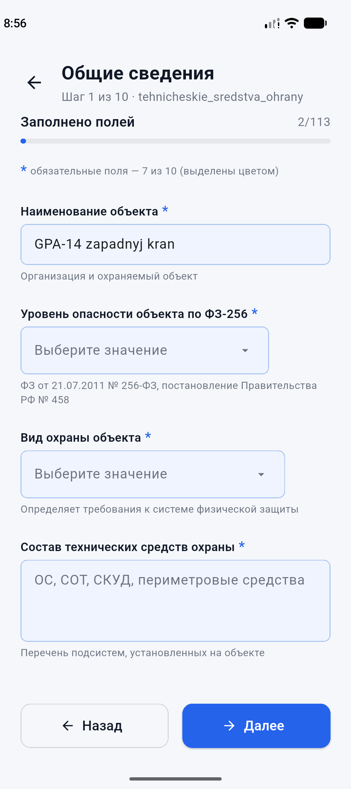 | 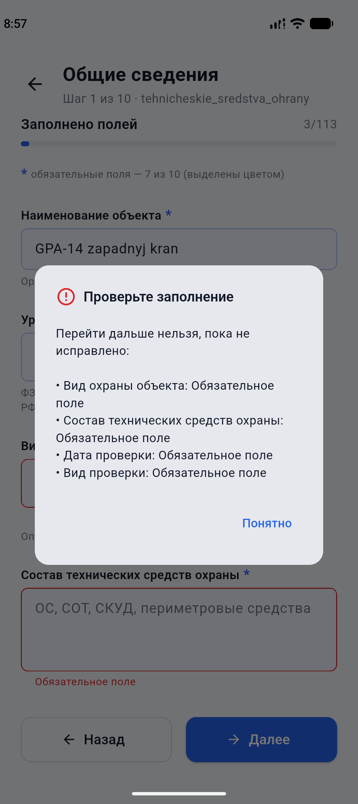 | 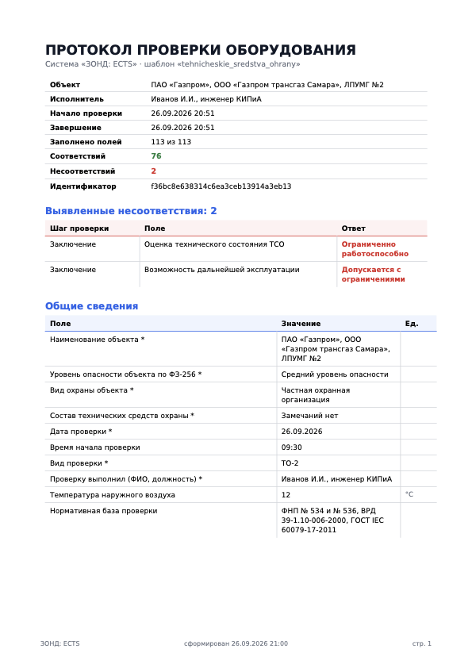 | 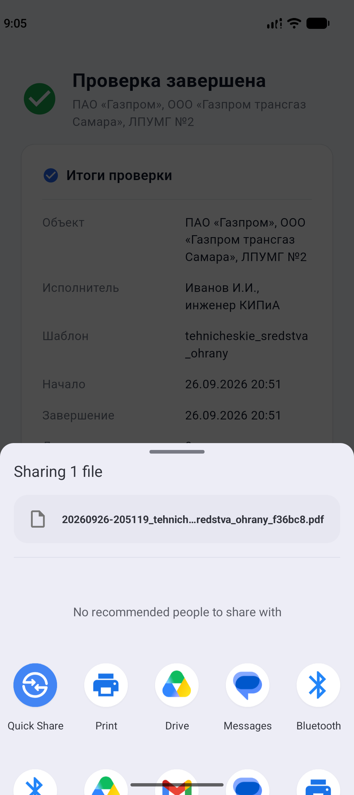 |

На стартовом экране действия подписаны пояснениями — откуда берётся шаблон и
что произойдёт, — а рядом есть справка:

| Стартовый экран | Справка | Итоги проверки |
|---|---|---|
|  | 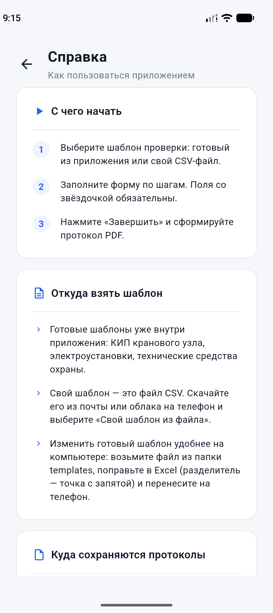 | 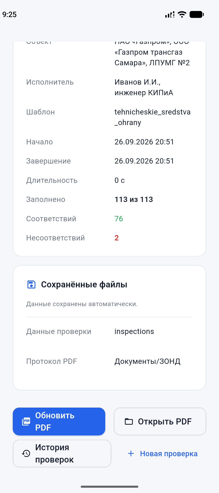 |

Повторный выезд: выбор прошлой проверки на экране шаблона и разбор её
замечаний со статусами.

| Выбор прошлой проверки | Разбор замечаний |
|---|---|
| 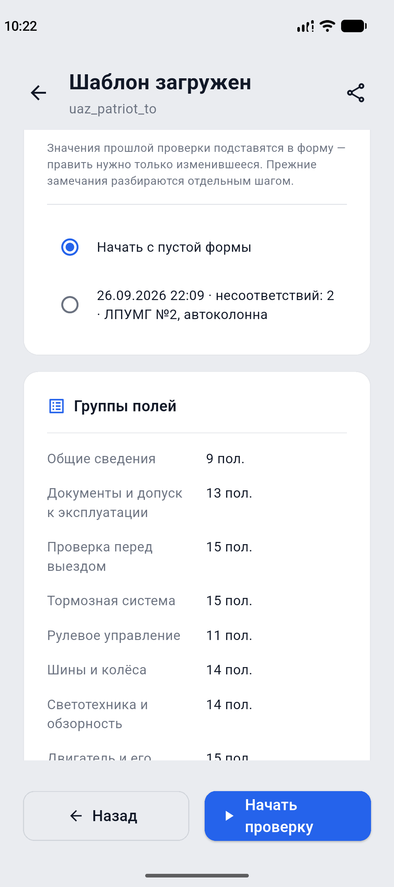 | 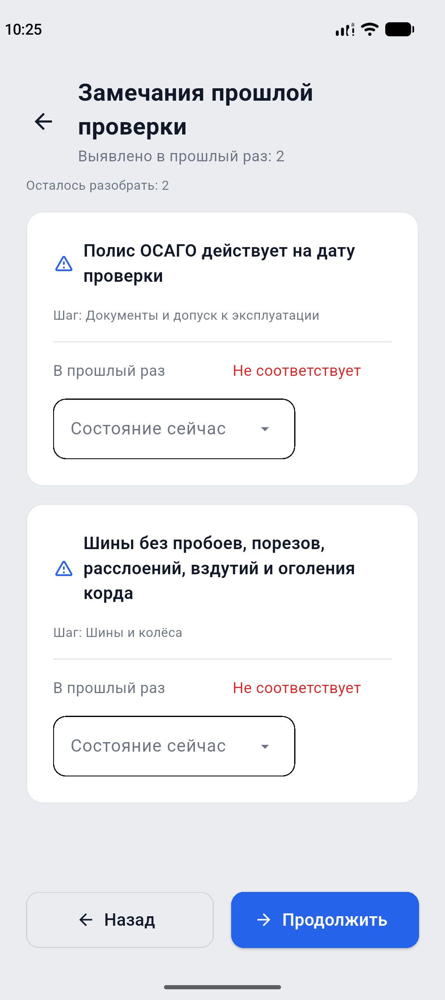 |

Отправка шаблона: файл уходит в системное меню вместе с почтой и облаком.

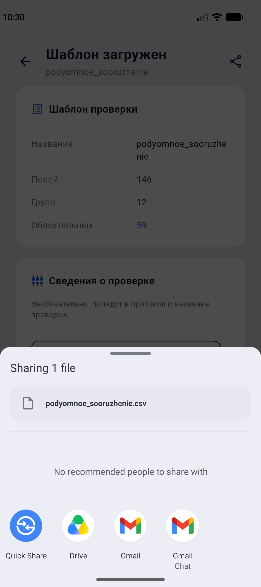

На экране итогов показано не полное расположение файлов, а понятное: папка
`Документы/ЗОНД` для протокола и `inspections` для данных проверки. Полный
путь остаётся в подсказке — на телефоне он не помещается и выглядит как мусор.

Осталось проверить на реальном телефоне:

- [ ] Выбор даты и времени системными диалогами.
- [ ] Черновик переживает закрытие приложения.
- [ ] Поворот экрана.
- [ ] Плавность на 152 полях шаблона КИП.
- [ ] Установка из Google Play (сборка `aab`).

---

## 9. Возможные сложности

| Симптом | Причина и решение |
|---|---|
| `flet build` не находит Flutter | Установите Flutter SDK и добавьте `flutter` в `PATH`, проверьте `flutter doctor` |
| Сборка Android падает на Gradle | Проверьте JDK 17 и `ANDROID_HOME` |
| В списке нет примеров шаблонов | Каталог `templates/` не попал в сборку: проверьте, что он не указан в `[tool.flet.app] exclude` |
| Выбранный файл не читается | Платформа не вернула содержимое: проверьте, что используется `with_data=True` |
| PDF не открывается | На мобильных используется меню «Поделиться»; при его недоступности путь к файлу показывается в диалоге |
| Файлы не сохраняются | Проверьте, что `prepare()` вызывается до показа интерфейса и каталог документов доступен |

---

## 10. Размер сборки

Что влияет на размер и что уже сделано:

* `[tool.flet.app] exclude` исключает из пакета виртуальное окружение, тесты,
  инструменты и документацию — без этого в сборку попала бы среда разработки;
* логотип интерфейса уменьшен с 1254×1254 (1,9 МБ) до 512×512 (265 КБ);
* иконка приложения хранится отдельно в `assets/icon.png`.

Собранный APK занимает около 150 МБ: в него входят среда Python и нативные
библиотеки сразу под три архитектуры. Для установки на конкретный телефон
используйте `flet build apk --split-per-abi` — получится три файла примерно
по 50 МБ, из которых нужен один.

Оставшийся вес определяется в основном средой Python внутри пакета.
